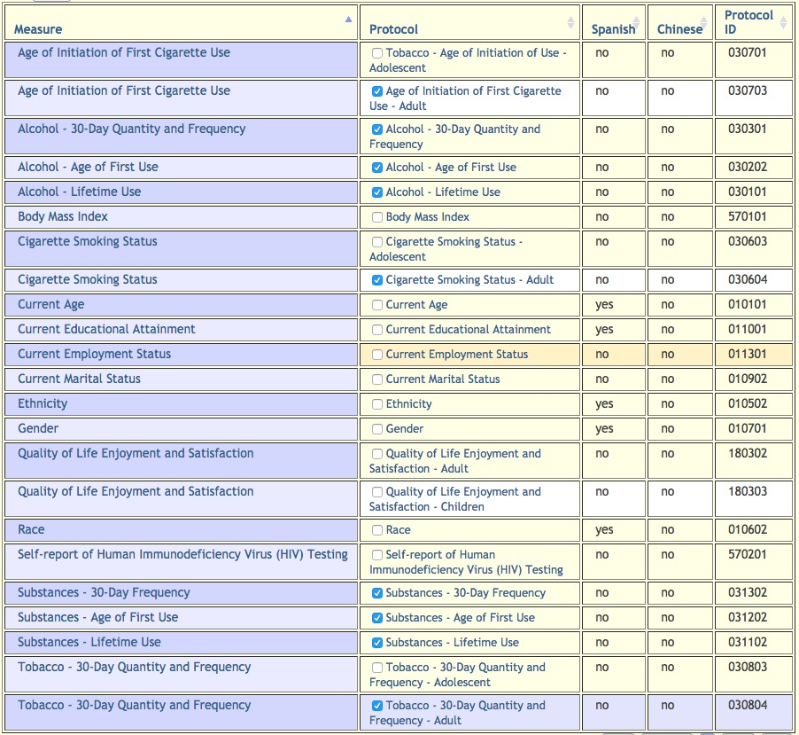

PhenX-measure-prospects
================
Rick Gilmore
2017-11-30 16:41:20

Substance Use And Addiction
---------------------------

-   [Substance Use Disorders Screener](https://www.phenxtoolkit.org/index.php?pageLink=browse.protocoldetails&id=580101). [Variables (csv)](https://www.phenxtoolkit.org/action.do.variable.download.php?protocolId=580101).
-   [Screening and Severity of Substance Use Problems - Adults - Alcohol - Lifetime](https://www.phenxtoolkit.org/index.php?pageLink=browse.protocoldetails&id=510203). [Variables (csv)](https://www.phenxtoolkit.org/action.do.variable.download.php?protocolId=510203)
-   [Screening and Severity of Substance Use Problems - Adults - Drugs \#510204](https://www.phenxtoolkit.org/index.php?pageLink=browse.protocoldetails&id=510204). [Variables (csv)](https://www.phenxtoolkit.org/action.do.variable.download.php?protocolId=510204)
-   [Substance Use and Addiction Core: Tier 1](https://www.phenxtoolkit.org/index.php?pageLink=browse.core.tier1)
    -   ROG selected the following measures to create a sample document. -

Mental Health
-------------

-   [Mental Health Research Core: Tier 1](https://www.phenxtoolkit.org/index.php?pageLink=browse.nimh.core.tier1)
-   [Mental Health Research Core: Tier 2](https://www.phenxtoolkit.org/index.php?pageLink=browse.nimh.core.tier2)

Recommendation
--------------

I recommend we use the Mental Health Research Core [Tiers 1](https://www.phenxtoolkit.org/index.php?pageLink=browse.nimh.core.tier1) and [2](https://www.phenxtoolkit.org/index.php?pageLink=browse.nimh.core.tier2).

Under Tier 1, we should adopt the [Broad Psychopathology](https://www.phenxtoolkit.org/index.php?pageLink=browse.protocols&id=610200) measure and consider whether to augment it with measures related to suicide or depression-specific items.

Under Tier 2, we should discuss possibly dropping the age of first use variables for tobacco, alcohol, and substance use and the Traumatic Life Events Scale (Tier 2) because it is proprietary.
